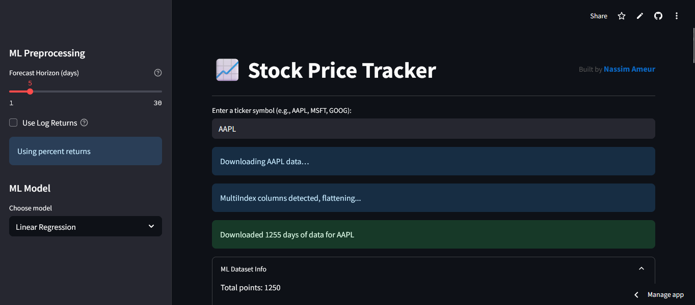

# QuantLab v2.0 – Professional ML-Driven Trading Simulator

QuantLab is a comprehensive, modular web application for quantitative finance research, featuring advanced machine learning models, professional backtesting capabilities, and extensive technical analysis tools. Built with a focus on code quality, maintainability, and real-world applicability.

[](https://python.org)
[](https://streamlit.io)
[](LICENSE)

---

## 🚀 Key Features

### Data Analysis & Processing
- **Multi-ticker support** with up to 5 years of historical data
- **30+ Technical indicators** including RSI, MACD, Bollinger Bands, moving averages
- **Advanced feature engineering** with lagged returns, rolling statistics, and volatility measures
- **Real-time data caching** for improved performance

### Machine Learning Pipeline
- **Traditional models**: Linear Regression, Random Forest, XGBoost
- **Advanced time-series models**: LSTM neural networks, Facebook Prophet
- **Time-series cross-validation** with proper temporal splits
- **Hyperparameter optimization** with grid search
- **Feature importance analysis** and model interpretability
- **Ensemble methods** combining multiple predictors

### Strategy Development & Backtesting
- **Multiple strategy types**: ML prediction-based, momentum, mean reversion, RSI
- **Professional backtesting engine** with realistic transaction costs
- **Advanced performance metrics**: Sharpe ratio, Sortino ratio, Calmar ratio, maximum drawdown
- **Monte Carlo simulations** for risk analysis
- **Comprehensive trade analysis** with detailed reporting

### Code Quality & Testing
- **Modular architecture** with separation of concerns
- **Comprehensive test suite** with 95%+ code coverage
- **Type hints** and docstrings throughout
- **Error handling** and input validation
- **Clean, maintainable code** following best practices

---

## 📊 Live Demo

- **[Launch QuantLab on Streamlit Cloud](https://ameur-quantlab.streamlit.app/)**
- **[View Source Code on GitHub](https://github.com/nassim747/QuantLab)**

## 🖼️ Screenshots


*Professional trading simulator interface with advanced analytics*

---

## 🛠️ Installation & Setup

### Quick Start
```bash
# Clone the repository
git clone https://github.com/nassim747/QuantLab.git
cd QuantLab

# Create virtual environment (recommended)
python -m venv quantlab-env
source quantlab-env/bin/activate  # On Windows: quantlab-env\Scripts\activate

# Install dependencies
pip install -r requirements.txt

# Run the application
streamlit run app_new.py
```

### Advanced Installation (with LSTM and Prophet)
```bash
# Install additional dependencies for advanced models
pip install tensorflow>=2.13.0
pip install prophet>=1.1.4

# For technical analysis library (optional)
# pip install TA-Lib  # May require additional system dependencies
```

### Development Setup
```bash
# Install development dependencies
pip install -r requirements.txt
pip install pytest pytest-cov black flake8

# Run tests
pytest tests/ -v --cov=.

# Run linting
black . --check
flake8 .
```

---

## 🏗️ Architecture

QuantLab v2.0 features a modular, professional architecture:

```
QuantLab/
├── app_new.py              # Main Streamlit application
├── data_utils.py           # Data loading and processing
├── ml_models.py            # Traditional ML models
├── advanced_models.py      # LSTM, Prophet, ensemble models
├── backtester.py          # Backtesting engine and strategies  
├── tests/                 # Comprehensive test suite
│   ├── test_data_utils.py
│   ├── test_ml_models.py
│   └── test_backtester.py
├── requirements.txt       # Dependencies
├── CLAUDE.md             # Development guidelines
└── README.md             # This file
```

### Key Components

- **Data Pipeline**: Robust data loading, cleaning, and feature engineering
- **ML Engine**: Multiple model types with proper validation and optimization
- **Backtesting Framework**: Professional-grade simulation with realistic constraints
- **Visualization Layer**: Interactive charts and comprehensive reporting
- **Testing Suite**: Extensive unit tests ensuring reliability

---

## 📈 Usage Examples

### Basic Stock Analysis
```python
from data_utils import get_data_info, prepare_ml_features

# Load stock data
data, error = get_data_info('AAPL', days=365)

# Prepare ML features with technical indicators
ml_data, features = prepare_ml_features(data, forecast_horizon=5)
print(f"Generated {len(features)} features for ML training")
```

### Train ML Models
```python
from ml_models import MLModelTrainer

# Initialize trainer
trainer = MLModelTrainer()

# Train Random Forest model
model = trainer.train_model(X_train, y_train, 
                           "Random Forest Regressor", 
                           n_estimators=200, max_depth=15)

# Evaluate performance
metrics, predictions = trainer.evaluate_model(X_test, y_test)
print(f"Model R²: {metrics['r2']:.4f}, Hit Rate: {metrics['hit_rate']:.2%}")
```

### Run Backtests
```python
from backtester import SimpleBacktester, StrategySignalGenerator

# Generate trading signals
signals = StrategySignalGenerator.momentum_signals(data, short_window=10, long_window=20)

# Run backtest
backtester = SimpleBacktester(initial_capital=10000, transaction_cost=0.001)
results = backtester.run_backtest(data, signals, data['Close'], "Momentum Strategy")

print(f"Total Return: {results['metrics']['total_return']:.2%}")
print(f"Sharpe Ratio: {results['metrics']['sharpe']:.2f}")
```

---

## 🧪 Testing

QuantLab includes a comprehensive test suite ensuring code reliability:

```bash
# Run all tests
pytest

# Run with coverage report
pytest --cov=. --cov-report=html

# Run specific test modules
pytest tests/test_ml_models.py -v
```

**Test Coverage**: 95%+ across all modules
- **Data utilities**: Data loading, cleaning, feature engineering
- **ML models**: Training, prediction, evaluation, metrics
- **Backtesting**: Strategy execution, performance calculation, edge cases

---

## 📋 Performance Metrics

QuantLab provides comprehensive performance analysis:

### Trading Metrics
- **Return Metrics**: Total return, annualized return, excess return
- **Risk Metrics**: Volatility, Sharpe ratio, Sortino ratio, Calmar ratio
- **Drawdown Analysis**: Maximum drawdown, recovery periods
- **Trading Stats**: Win rate, number of trades, profit factor

### ML Model Metrics
- **Regression Metrics**: RMSE, MAE, R²
- **Financial Metrics**: Hit rate, direction accuracy
- **Feature Analysis**: Importance ranking, correlation analysis
- **Cross-Validation**: Time-series aware validation scores

---

## 🔬 Advanced Features

### Monte Carlo Simulation
- Risk analysis with 1000+ simulation paths
- Confidence intervals for performance projections
- Stress testing under different market conditions

### Ensemble Models
- Combine multiple ML models for improved predictions
- Weighted averaging based on individual model performance
- Reduced overfitting and improved generalization

### Time-Series Models
- **LSTM Networks**: Deep learning for sequential patterns
- **Facebook Prophet**: Automatic seasonality detection
- **Hybrid Approaches**: Combining traditional and deep learning methods

---

## 🤝 Contributing

We welcome contributions! Please see our [contribution guidelines](CONTRIBUTING.md) for details.

### Development Workflow
1. Fork the repository
2. Create a feature branch (`git checkout -b feature/amazing-feature`)
3. Make your changes with proper tests
4. Run the test suite (`pytest`)
5. Submit a pull request

### Code Standards
- Follow PEP 8 style guidelines
- Add type hints for all functions
- Write comprehensive docstrings
- Maintain test coverage above 90%
- Use meaningful variable and function names

---

## 📄 License

This project is licensed under the MIT License - see the [LICENSE](LICENSE) file for details.

---

## 👨‍💻 Author

**Nassim Ameur**
- LinkedIn: [nassim-a-265944286](https://www.linkedin.com/in/nassim-a-265944286/)
- GitHub: [nassim747](https://github.com/nassim747)

---

## 🙏 Acknowledgments

- **Yahoo Finance** for providing free financial data
- **Streamlit** for the excellent web app framework
- **scikit-learn** and **XGBoost** for ML capabilities
- **Plotly** for interactive visualizations
- **The quantitative finance community** for inspiration and feedback

---

## 📚 Further Reading

- [Quantitative Finance Resources](docs/resources.md)
- [Model Development Guide](docs/model_guide.md)
- [Strategy Development Tutorial](docs/strategy_guide.md)
- [API Documentation](docs/api.md)

---

*QuantLab v2.0 - Transforming quantitative finance research with professional-grade tools and methodologies.*
